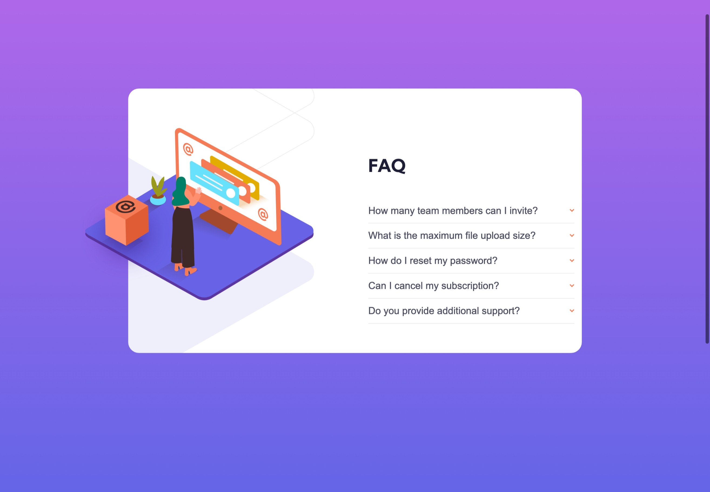
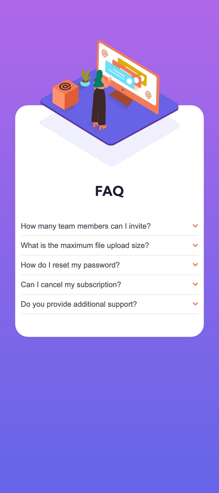

# Frequently Asked Questions Accordion Card Docs

## Overview

### User Stories

- View optimal layout for components depending on their device’s screen size.
- See hover states for all interactive elements on the page.
- Hide/Show the answer to a question when the question is clicked.

### Features

- A subtle animation to the illustration
- Hover states applied to all interactive elements on the page
- The answer to question are revealed when the user clicked the question.
- A change in direction of the icon arrow when the answers to the question are revealed.

### Screenshots of Frequently Asked Question Accordion Card



A desktop view of the accordion card



A mobile view of the accordion card. 

## Process

### Tools Used

- HTML5
- CSS
- JavaScript
- Parcel for Bundling

### Learning Curves

For this project, a lot of concepts where picked up and new ways of doing things were learnt during the execution of this project. Other variations of the accordion card was built and a link will be provided at the end of the learning curve process. 

I want to talk about how I was able to plan and implement some of the features of this accordion card project which I really enjoyed building. 

**Working with Responsive Images**

When working on this project I decided to learn about the concept of responsive images - Images that work well on devices with widely differing screen sizes, resolution, and other such features and look at what tools HTML provides to help implement them. This helps to improve performances across different devices. Doing this is just one part of responsive design. It might have been important when working with Vector images but it is necessary for the so called raster image format such as JPEGS as vector images tend to scale well irrespective of the device size. 

Responsive image technologies were implemented recently to solve the problems explained earlier by letting me offer the browser several image files, either all show the same thing but containing different number of pixels (resolution switching), or different image suitable of different space allocations (art direction) — I will not be talking about art direction as I never implemented this technique.

The concept which I used is ***resolution switching*** and that is what I wish to be talking about but how was this done ? 

With ***resolution switching***,  we need to ask ourselves what problems we intend to solve? Most often the aim is to display identical image content, just larger or smaller depending on the device.  Doing this we use the `` tag but this lets us point the browser to a single source file. 

```html

```

However, we can make use of two attributes —— `srcset` and `sizes` —— to provide several additional source images along with some hints to help the browser pick the right one. Which can be seen my code snippet from the project below. 

```html

```

Seeing this code snippet above we need to ask ourselves what is the role of the `srcset` and the `sizes` attribute. 

The `srcset` defines a set of images we will allow the browser to choose between and what size the image is. Each set if image is separated by a comma. We have an image file name, a space and the image’s intrinsic width in pixels (`237w`). The intrinsic width uses w unit, not px as you might expect. The intrinsic width is the the real size. 

The `sizes` attribute defines a set of media conditions (e.g. screen widths) and indicates what image size would be best to choose, when certain conditions are true. Before each comma we write a media condition, a space, the width of the slot the image will fall when the media conditions are true. 

With these attributes in place, the browser will; 

- Look at what the device width is.
- Workout which media conditions is the first one to be true.
- Look at the slot sizes given to that media query.
- Load the image referenced in the `srcset` list that has the same as the slot, or if there is not one, the first image that is bigger than the the chosen slot size.

Also note, the slot width does not accept the use of percentages but absolute width e.g. `472px` or width that is relative to the viewport e.g `50vw` can be provided. If the first condition is matched the browser goes ahead to ignore everything after the first matching condition, so the order of the media conditions is important. 

The caveat here is that older browsers do not support these features and will ignore them. Instead, these browsers will go ahead and load the image referenced in the `src` attribute as normal. 

We can also use resolution switching by having same sized image then you can opt to use a different resolution although not used in this project, I would expand more on this. If you are supporting multiple display resolutions, but everyone will see the image at the same real world size on the screen, it is possible to allow the browser to choose an appropriate resolution image by using `srcset` with x-descriptors and without sizes. 

```css
img { width: 475px; }
```

```html

```

As can be seen in the code snippet above, the `sizes` attribute is not needed as the browser will work out what resolution the display is being shown on and serve the most appropriate image referenced in the `srcset`. So if the device accessing the page has a standard/low resolution display, with one device pixel representing each CSS pixel, the `assets/images/illustration-woman-online-mobile.svg` image would have been used but if the device has a high resolution of two devices pixels per CSS pixels or more, the  `assets/images/illustration-woman-online-desktop.svg` would be loaded. 

**CSS Selectors** 

While doing this project I learnt a new type of selector called the ***attribute selector***. This selector selects all elements that has a given attribute. This selector will match an element based on the presence or value of a given attribute. There are so many different ways to style HTML elements that have specific attribute or attribute values. I was able to implement just a few in this project. 

The `[attr=’value’]` selector would be used to select an element with a specified attribute and value. It represents an element with an attribute name `attr` whose value is exactly `value` . 

The `[attr~=’value’]` selector would be used to select an element whose attribute value contains a specified word. It represents an element with an attribute name `attr` whose value is a white separated list of words that contains the word `value`. 

Although there are many other ways of selecting elements using the attribute elements, these were the ones I needed as of this project. Also I opted for this over normal classes as it makes it easier to easily navigate from CSS file to HTML if I do come back in the near future to make some modifications to the project in some days or months time. 

**CSS animations**

An animation lets an element gradually changes from one style to another. It allows for the changing of as many properties as desired, as many times as possible. To be able to use this CSS animations, a keyframe for the animation must be used. 

The keyframes holds what style the element will have at certain times. Whenever we specify the css styles inside a keyframe rule, the animations will gradually change from the current style to the new style at certain times. 

The `@keyframes` rule specifies the animation code. To get an animation to work, you must bind the animation to the element. See the code snippet below

```css
/* From the animate.css style */

img {
	animation: 4s ease-in-out 0s infinite alternate animate-image-illustration;
}

@keyframes animate-image-illustration {
  0% {
    transform: translateX(-50%) translateY(-63%) rotate(2deg); 
  }

  100% {
    transform:  translateX(-50%) translateY(-57%) rotate(-2deg); 
  }
}
```

Note that when an animation is finished it goes back to its original style. 

As can be seen from the snippet above a shorthand animation property is used. From the animation shorthand the order of the values within each animation definition is important. From the code snippet above the first value that can be parsed as `<time>` is assigned to the `animation-duration`, and the second one is assigned to `animation-delay` . 

The order of other values within each animation definition is also important for distinguishing the `animation-name` value from other values. If a value in the animation shorthand can be parsed as a value for an animation property other than `animation-name`, then the value will be applied to that property first and not the animation name. For this reason it is best to specify a value for the animation name as the last value in a list of values as seen in the snippet above when using the animation shorthand. This also applies even when you specify multiple comma-separated animations using the animation shorthand. 

If there is no `animation-name` then there is no animation to apply on any of the properties and when the `animation-duration` value is omitted from the animation shorthand property, the value of this property defaults to 0s.

Let us break down the values used in the animation shorthand: 

`4s`: This is the `animation-duration` which specifies the length of time when an animation completes one cycles or It is the how long you want the animation to take place. 

`ease-in-out`: This is the `animation-timing-function` which specifies how an animation transition through keyframes establishing acceleration curves. In this case I wanted the animation to have a slow start and a slow end. 

`0s`: This is the `animation-delay` which specifies the delay between an element loading and starting the animation sequence and whether an animation should start immediately from the beginning or partway through the animation. Here I do not need any delay although I might not even have included it and it would still defaulted to 0s as just explained above. 

`infinite`: The specifies the `animation-iteration-count` which specifies the number of times that the animation should repeat. I want the animation to go on forever. 

`alternate`: This is the `animation-direction` which specifies whether an animation’s first iteration should be forward or backward and whether subsequent iterations should alternate direction on each run through the sequence or rest to the start point and repeat. The animation will play forwards and then play backwards. 

`animate-image-illustration`: As explained earlier since this value does not belong or can not be parsed to any animation property other than animation-name then it can be used as the animation-name which specifies the name of the `@keyframes` at-rule describing the animation’s keyframes. 

Since the `@keyframes` CSS at-rule controls the intermediate steps in a CSS animation sequence be defining styles for keyframes (or waypoints) along the animation sequence. More controls can be gotten over the intermediate steps of the animation sequence. Inside the `@keyframes` rule as seen in the snippet above a style list of keyframe selectors which specify percentages (`0%` and `100%` ) along the animation when the keyframes occurs and a block which contains the style for the keyframe. The style for this effect was done by making use of the `transform: translate` property along the `X` and `Y` axis and the `transform: rotate` property to give it that subtle see-saw movement. 

**Structuring an Accessible Accordion Card** 

The accordion widget which was built requires some accessibility and was done to make it useful for everyone. Accordions are generally used to reduce the amount of information presented to the user. Accordions is basically a list of items, each composed with two parts: a ***header*** and ***panel***. 

The ***header*** is a summary of the section of content we want to show/hide. It also serves as the visibility control of the content (hint: `<button>`), meaning it is interactive with a mouse, a keyboard, and even fingers on a mobile device. It usually contains a title describing the section, and a visual indicator of the visibility state of the accordion item. 

The ***panel*** is the section of the content we want to show/hide. When the accordion is closed, the panel should not be visible or interact-able (e.g focusable elements should not be focusable when they are not visible on the screen). 

Since HTML does not provide an accordion element natively, there has to be a way to implement the widget by making sure it is accessible to keyboards and screen reader users. To be able to implement this the use of ARIA roles, state and properties. 

- The title for the header must be written within a `<button/>`
- Each button within an accordion header, is associated with its corresponding panel by using `aria-controls = <panel-id>`
- Each accordion has an aria-attribute identifying the state of its corresponding panel. **Expanded**: `aria-expanded = “true”` **Collapsed**: `aria-expanded = “false”`

The `aria-controls` is a global attribute that identifies the element or elements whose content or presence are controlled by the element on which the attribute is set. When the interactive widget or element is used to adjust or modify another element or component in a document or application, the aria-controls attribute can be used to programmatically associate the corresponding element/elements with the controlling element. 

The `aria-expanded` attribute is set on element if the control is expanded or collapsed, and whether or not its child element are displayed or hidden. This attribute is applied to focusable, interactive control that toggles the visibility of the object. 

When  the `aria-expanded` attribute is applied to a parent item in the DOM tree to indicate whether its child branch is shown. The parent also controls the visibility of the associated branch. 

It is also possible to use an object to control the visibility of another object. We can combine `aria-expanded` with `aria-controls` which as explained earlier indicates controlling element and controlled element. The `aria-expanded` indicates to assistive technology whether the controlled element is expanded or collapsed. 

To build this accordion to be accessible I followed these steps below:

Step 1: Markup structure

To get a good markup structure there are so many ways it can be done and it depends on the context where the accordions can be used and how to structure it in the HTML properly. Personally I opted to use a ***description list*** (`dl`) which was a parent element to some ***description titles*** (`dt`) and ***description definitions*** (`dd`). You can also use a `h3` in place of a `dt` and a `section` element in place of `dd` . 

See code snippet below:

```html
<dl>

	<!--Header-->
	<dt>
		<button>Is this an FAQ question?</button>
	</dt>

	<!--Panel-->
	<dd>
		Yes, it is.
	</dd>

	<!--Header-->
	<dt> 
		<button>What about this one?</button>
	</dt>

	<!--Panel-->
	<dd>
		Yep, this too. 
	</dd>

</dl>
```

Step 2: Mark icon as decorative

Most accordion including the one I built tends to have an icon in the header that helps the users kind of visualise the state of the accordion. The icon is just an extension of the accordion state, so it should be marked as a decorative icon, hiding it from assistive technology users. To be able to achieve this I used the `aria-hidden = “true”` attribute to the icon as shown below:

```html
<svg aria-hidden = "true" 
		 width="10" 
		 height="7" xmlns="http://www.w3.org/2000/svg"><path 
		 d="M1 .799l4 4 4-4" 
		 stroke="#F47B56" 
		 stroke-width="2" 
		 fill="none" 
		 fill-rule="evenodd"/>
</svg>
```

Step 3: Establish a Relationship

I needed to find a way to let the screen reader know that each `dt` element corresponds to a `dd` element respectively and the only way to do this was to establish/mark the relationship between the accordion header (`dt`) and panel (`dd`). So I needed the accordion header to control the panel to mark the relationship, we can make use of the `aria-controls` attribute explained earlier and we give it a value that is the `id` of the accordion panel. 

See code snippet below: 

```html
<dl aria-label = "Frequently Asked Questions Accordion Group Buttons" class = "accordion__description-list">
          <!-- Header-1-->
          <dt class = "accordion__description-title">
            <button class = "accordion__btn" aria-controls = "accordion__panel-1" >
              How many team members can I invite?
              <svg aria-hidden = "true" width="10" height="7" xmlns="http://www.w3.org/2000/svg"><path d="M1 .799l4 4 4-4" stroke="#F47B56" stroke-width="2" fill="none" fill-rule="evenodd"/></svg>
            </button>
          </dt>
          <!-- Panel-1 -->
          <dd class = "accordion__description-definition" id = "accordion__panel-1">
              <p class = "accordion__panel-text">
                You can invite up to 2 additional users on the Free plan. There is no limit on 
                team members for the Premium plan.
              </p>
          </dd>

          <!-- Header-2 -->
          <dt class = "accordion__description-title">
            <button class = "accordion__btn" aria-controls = "accordion__panel-2">
              What is the maximum file upload size?
              <svg aria-hidden = "true" width="10" height="7" xmlns="http://www.w3.org/2000/svg"><path d="M1 .799l4 4 4-4" stroke="#F47B56" stroke-width="2" fill="none" fill-rule="evenodd"/></svg>
            </button>
          </dt>

          <!-- Panel-2 -->
          <dd class = "accordion__description-definition" id = "accprdion__panel-2">
            <p class = "accordion__panel-text">
              No more than 2GB. All files in your account must fit your allotted storage space.
            </p>
          </dd>
</dl>

<!-- Part of code was used to show this illusration -->
```

Step 4 : Handle State

The last thing to do is to have the accordion state (open or closed) being communicated to the screen reader users. To mark the accordion items as open, we use the `aria-expanded` attribute on the accordion header and sets its value to `true`. and to mark it to close we just need to change the value to `false`. JavaScript will be used to dynamically switch between both the open and closed depending on the condition of the state. I will explain how this is done using JavaScript soon. 

```html
<dl aria-label = "Frequently Asked Questions Accordion Group Buttons" class = "accordion__description-list">
          <!-- Header-1-->
          <dt class = "accordion__description-title">
            <button class = "accordion__btn" aria-controls = "accordion__panel-1" aria-expanded = "false" >
              How many team members can I invite?
              <svg aria-hidden = "true" width="10" height="7" xmlns="http://www.w3.org/2000/svg"><path d="M1 .799l4 4 4-4" stroke="#F47B56" stroke-width="2" fill="none" fill-rule="evenodd"/></svg>
            </button>
          </dt>
          <!-- Panel-1 -->
          <dd class = "accordion__description-definition" id = "accordion__panel-1">
              <p class = "accordion__panel-text">
                You can invite up to 2 additional users on the Free plan. There is no limit on 
                team members for the Premium plan.
              </p>
          </dd>

          <!-- Header-2 -->
          <dt class = "accordion__description-title">
            <button class = "accordion__btn" aria-controls = "accordion__panel-2" aria-expanded = "false">
              What is the maximum file upload size?
              <svg aria-hidden = "true" width="10" height="7" xmlns="http://www.w3.org/2000/svg"><path d="M1 .799l4 4 4-4" stroke="#F47B56" stroke-width="2" fill="none" fill-rule="evenodd"/></svg>
            </button>
          </dt>

          <!-- Panel-2 -->
          <dd class = "accordion__description-definition" id = "accprdion__panel-2">
            <p class = "accordion__panel-text">
              No more than 2GB. All files in your account must fit your allotted storage space.
            </p>
          </dd>
</dl>

<!-- aria-expanded set to false as I want the initial state to be closed on load -->
```

For the closed state, we also need make sure that the accordion panel is no visible and we also need to prevent the accordion panel from being reached by keyboards, screen readers, and users. One way of many ways is to use the `hidden` attribute this works the same say as the CSS `display: none;` . The hidden attribute generally doesn’t have a value but you can use any of these. 

- `hidden = “”`
- `hidden = “hidden”`
- `hidden = “can also take in any rubbish you write here”`

See code snippet below:

```html
<dl aria-label = "Frequently Asked Questions Accordion Group Buttons" class = "accordion__description-list">
          <!-- Header-1-->
          <dt class = "accordion__description-title">
            <button class = "accordion__btn" aria-controls = "accordion__panel-1" aria-expanded = "false" >
              How many team members can I invite?
              <svg aria-hidden = "true" width="10" height="7" xmlns="http://www.w3.org/2000/svg"><path d="M1 .799l4 4 4-4" stroke="#F47B56" stroke-width="2" fill="none" fill-rule="evenodd"/></svg>
            </button>
          </dt>
          <!-- Panel-1 -->
          <dd hidden class = "accordion__description-definition" id = "accordion__panel-1">
              <p class = "accordion__panel-text">
                You can invite up to 2 additional users on the Free plan. There is no limit on 
                team members for the Premium plan.
              </p>
          </dd>

          <!-- Header-2 -->
          <dt class = "accordion__description-title">
            <button class = "accordion__btn" aria-controls = "accordion__panel-2" aria-expanded = "false">
              What is the maximum file upload size?
              <svg aria-hidden = "true" width="10" height="7" xmlns="http://www.w3.org/2000/svg"><path d="M1 .799l4 4 4-4" stroke="#F47B56" stroke-width="2" fill="none" fill-rule="evenodd"/></svg>
            </button>
          </dt>

          <!-- Panel-2 -->
          <dd hidden class = "accordion__description-definition" id = "accprdion__panel-2">
            <p class = "accordion__panel-text">
              No more than 2GB. All files in your account must fit your allotted storage space.
            </p>
          </dd>
</dl>

```

**Implementing the functionality of the Accordion with JavaScript**

The final thing to be done was to implement the functionality of the accordion and bring some life into it. I want to be able to click each button and have their responsive panel show or hide with every click. I want to make use of event bubbling as I do not want to have to attach an event listener and handler to every button. Using some class based approach to solve this problem, inside the class define make a reference to the accordion. See code snippet: 

```jsx
class AccordionComponent {
	#accordion = document.querySelector("div[class='accordion']");
	
	constructor() {

	}
}

new AccordionComponent(); 
```

Inside the constructor which gets called as soon as the we use the `new` keyword, attach the **eventListene**r to the accordion which we made a private field and then add a `click` event and the **eventHandler** 

```jsx
class AccordionComponent {
	#accordion = document.querySelector("div[class='accordion']");
	
	constructor() {
		this.#accordion.addEventListener('click', this.#showPanelOnClick)
	}
}

new AccordionComponent();

// WE should get an error here as we have not defined the showPanelOnClick method yet
```

Next step is we need to ask ourselves what to we want to do when the accordion is click ? The accordion isn’t what we want click but because we are making use of event bubbling we can pass in the event Object  `evtObj` inside the method. When this is done then we can easily get the button which is what we want. See code snippet below: 

```jsx
class AccordionComponent {
	#accordion = document.querySelector("div[class='accordion']");
	
	constructor() {
		this.#accordion.addEventListener('click', this.#showPanelOnClick); 
	}

	#showPanelOnClick(evtObj) {
		const accordionBtn = evtObj.target.closest("button[class~='accordion__btn']"); 
	}
}

new AccordionComponent();

// The closest method searches up the DOM tree and picks the desired element we want
// See it as the opposite of querySelector method. 
```

After doing this above it is also still possible for the user not to click the button within the accordion element and if the user does that it means that `accordionBtn` will return null meaning it couldn’t find our button element. To avoid any bugs we have to use some sort of guard clause. 

```jsx
class AccordionComponent {
	#accordion = document.querySelector("div[class='accordion']");
	
	constructor() {
		this.#accordion.addEventListener('click', this.#showPanelOnClick)
	}

	#showPanelOnClick(evtObj) {
		const accordionBtn = evtObj.target.closest("button[class~='accordion__btn']");

		if (!accordionBtn) return; 
	}
}

new AccordionComponent();

// If the accordionBtn is null which is falsy then lets make it truthy to satisfy
// the if block and return nothing but it it returns the button element which truthy
// then lets invert it and make it falsy meaning the if block is skipped. 
```

We need to navigate our way to the accordion panel from the button or we could have just selected it from the DOM which ever one is ok for you. We also need to know the current state of the accordion is open or close so we get that from the accordion header and we have to manipulate that state. See code snippet below:

```jsx
class AccordionComponent {
	#accordion = document.querySelector("div[class='accordion']");
	
	constructor() {
		this.#accordion.addEventListener('click', this.#showPanelOnClick)
	}

	#showPanelOnClick(evtObj) {
		const accordionBtn = evtObj.target.closest("button[class~='accordion__btn']");

		if (!accordionBtn) return; 

		const accordionPanel = accordionBtn.parentElement.nextElementSibling; 

		const isExpanded = accordionBtn.getAttribute('aria-expanded') === 'true' || false; 
	}
}
```

When the button is clicked we need to mutate the `isExpanded` value which is boolean of false to become true. This is because when I click the value I want to let the screen reader know that the accordion is open so we have to set the inverse of the `isExpanded` value as a string. 

```jsx
class AccordionComponent {
	#accordion = document.querySelector("div[class='accordion']");
	
	constructor() {
		this.#accordion.addEventListener('click', this.#showPanelOnClick)
	}

	#showPanelOnClick(evtObj) {
		const accordionBtn = evtObj.target.closest("button[class~='accordion__btn']");

		if (!accordionBtn) return; 

		const accordionPanel = accordionBtn.parentElement.nextElementSibling; 

		const isExpanded = accordionBtn.getAttribute('aria-expanded') === 'true' || false; 

		accordionBtn.setAttribute('aria-expanded', `${!isExpanded}`); 
	}
}
```

To wrap it up we want to display the accordion panel and hide it click the button and this depends on the `isExpanded` state we also want to make the title of the accordion header more bold when it is open and make it normal when closed. 

```jsx
class AccordionComponent {
	#accordion = document.querySelector("div[class='accordion']");
	
	constructor() {
		this.#accordion.addEventListener('click', this.#showPanelOnClick)
	}

	#showPanelOnClick(evtObj) {
		const accordionBtn = evtObj.target.closest("button[class~='accordion__btn']");

		if (!accordionBtn) return; 

		const accordionPanel = accordionBtn.parentElement.nextElementSibling; 

		const isExpanded = accordionBtn.getAttribute('aria-expanded') === 'true' || false; 

		accordionBtn.setAttribute('aria-expanded', `${!isExpanded}`); 

		if (isExpanded) {
			accordionPanel.setAttribute('hidden', ''); 
			accordionBtn.classList.remove('accordion__btn--active'); 
		} else {
			accordionPanel.removeAttribute('hidden'); 
			accordionBtn.classList.add('accordion__btn--active'); 
		}
	}
}
```

Objective achieved 😀

## Resources

Here are some resources that helped me while building this project. 

[Mozilla Developer Network (MDN)](https://developer.mozilla.org/en-US/docs/Web/HTML/Element/dl) - Good resource from MDN to help me understand how to work with the description list. 

[w3schools](https://www.w3schools.com/jsref/met_element_removeattribute.asp) - I used this when I need to know how to remove the hidden attribute when the state of the accordion header changed. 

[w3schools](https://www.w3schools.com/jsref/prop_node_parentelement.asp) - When navigating the DOM to search for the accordion panel this `parentElement` property was used. The `parentElement` and `parentNode` property both do the same thing the only difference is that `pareElement` returns `null` if the element’s parent is not an element node. 

[Youtube](https://www.youtube.com/watch?v=2QYpkrX2N48) - Kevin Powell does a great job of explaining resolution switching on this video I hope you find it useful in the future if you do wish to know a lot more about responsive images. 

[Mozilla Developer Network (MDN)](https://developer.mozilla.org/en-US/docs/Web/Accessibility/ARIA/Attributes/aria-expanded) - For a better understanding of `aria-expanded` attribute. 

[Mozilla Developer Network (MDN)](https://developer.mozilla.org/en-US/docs/Web/Accessibility/ARIA/Attributes/aria-controls) - For a better understanding of `aria-controls` attribute. 

[Web Accessibility Initiative](https://www.w3.org/WAI/ARIA/apg/patterns/accordion/) - This was the guide I used to be able to build the accordion for it to be accessible. 

## Acknowledgement

I want to acknowledge FrontEnd Mentor for providing this challenge. 

## *Bonus

- I also made another variation of the accordion card. This one will only allow one panel to show at a time. If one accordion header is clicked the corresponding panel is opened and any other accordion header which was expanded gets collapsed.

[https://codepen.io/TraversetheDOM/pen/jOvLxre](https://codepen.io/TraversetheDOM/pen/jOvLxre)

- I attempted doing the accordion card using only CSS which I found quite interesting. I made use of the interactive elements i.e `<details>` and `<summary>` elements to do this.

[https://codepen.io/TraversetheDOM/pen/NWLyvZa](https://codepen.io/TraversetheDOM/pen/NWLyvZa)